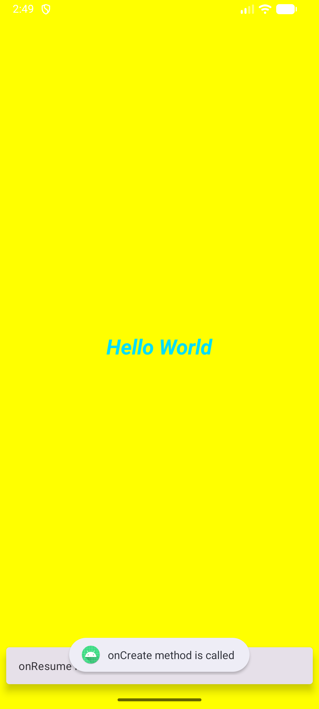
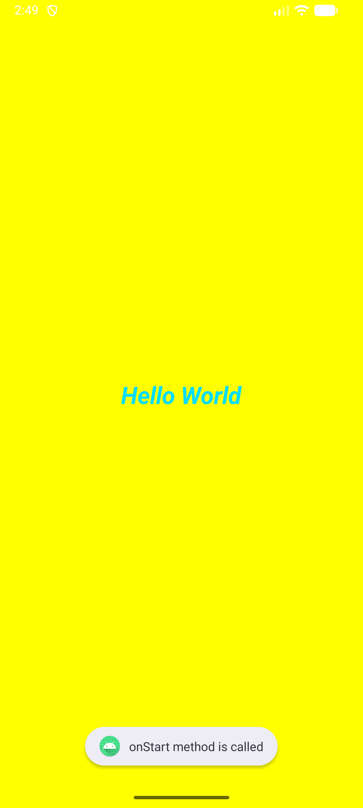
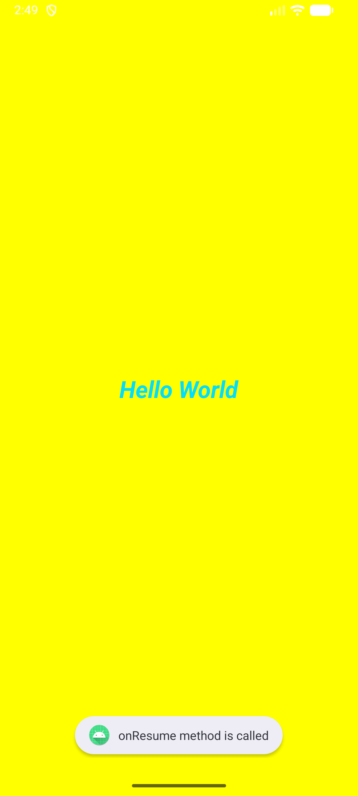

# 24012011128 MAD Practical 2

An Android application developed using Kotlin and Android Studio to demonstrate the **Android Activity Lifecycle** and different ways of displaying lifecycle event messages.

## Features

- Demonstrates the complete Android Activity Lifecycle.
- Handles the following lifecycle methods:
  - `onCreate()`
  - `onStart()`
  - `onResume()`
  - `onPause()`
  - `onStop()`
  - `onRestart()`
  - `onDestroy()`
- Displays lifecycle messages in **Logcat**.
- Displays lifecycle messages using **Toast** notifications.
- Displays lifecycle messages using **Snackbar**.
- Uses a simple ConstraintLayout-based user interface.

## Technologies Used

- Kotlin
- Android Studio
- Android SDK
- AndroidX
- ConstraintLayout
- Material Components
- Gradle

## How It Works

When the application starts or its activity changes state, the corresponding lifecycle method is called. The application displays a message for each lifecycle event through Logcat, Toast, and Snackbar.

For example:

```text
onCreate method is called
onStart method is called
onResume method is called
```

When the activity is paused, stopped, restarted, or destroyed, the corresponding lifecycle messages are displayed.

## Project Structure

```text
24012011128_MAD_PRAC2/
├── app/
│   └── src/
│       └── main/
│           ├── java/
│           │   └── com/example/a24012011128_mad_practical_2/
│           │       └── MainActivity.kt
│           ├── res/
│           │   ├── layout/
│           │   │   └── activity_main.xml
│           │   └── ...
│           └── AndroidManifest.xml
└── README.md
```

## Requirements

- Android Studio
- Android SDK with API level 37
- JDK 11
- Android device or emulator running Android API 24 or higher

## How to Run

1. Clone or download the repository.
2. Open the project in Android Studio.
3. Allow Gradle to sync and download the required dependencies.
4. Connect an Android device or start an emulator.
5. Click **Run** in Android Studio.
6. Interact with the application or change the activity state to observe the lifecycle messages.

#Screenshots

|  |  |  |
| :---: | :---: | :---: |
|  |  |  |
---

## Application Details

**Application ID:** `com.example.a24012011128_mad_practical_2`

**Minimum SDK:** 24

**Target SDK:** 37

**Version:** 1.0
